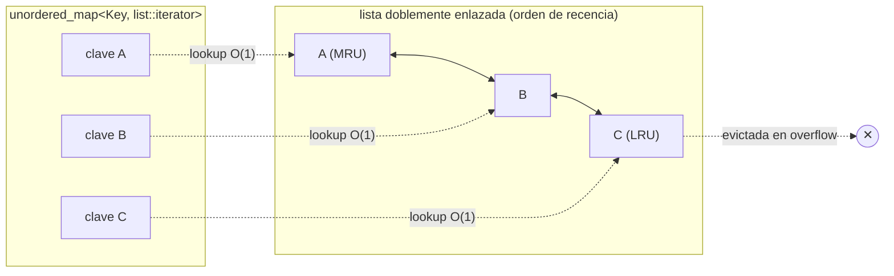

<!-- ══════════════════════════ PORTADA ══════════════════════════ -->
<div align="center">
  
</div>

<br/>

<!-- ══════════════════════ IDIOMAS / LANGUAGES ══════════════════════ -->
<div align="center">
<a href="README.md"></a>
<a href="README.en.md"></a>
<a href="README.es.md"></a>
</div>

<br/>

<h1 align="center">lru-cache-cpp</h1>
<p align="center"><em>Caché LRU O(1), header-only y templated, para C++17 moderno</em></p>
<p align="center"><strong>unordered_map + lista doblemente enlazada → put/get/evict en O(1)</strong></p>

<div align="center">


</div>

<div align="center">
<a href="#acerca-de"></a>
<a href="#cómo-funciona"></a>
<a href="#api"></a>
<a href="#uso"></a>
</div>

<br/>

> 📦 **Header-only.** Solo incluye `lru_cache.hpp` — sin build step, sin enlazado.

## Acerca de

Un caché **LRU (Least-Recently-Used)** pequeño, header-only y templated para C++17 moderno. Elige el tipo de clave y valor, y ten un caché de capacidad fija con inserción, búsqueda y evicción en **O(1)**.

**Destacados:**
- **Header-only** — sin build step, sin enlazado.
- **Operaciones O(1)** — `put`, `get`, `contains` y `erase` son todas amortizadas en tiempo constante.
- **Templated** — funciona con cualquier tipo de clave hasheable y cualquier tipo de valor.
- **Recency-aware** — `get` actualiza la entrada para que las claves usadas con frecuencia sobrevivan a la evicción.
- **`peek` no mutante** — inspecciona un valor sin alterar el orden de recencia ni las estadísticas.
- **Estadísticas de hit/miss** — `stats()` reporta hits/misses acumulados de `get`.
- **Búsquedas con `std::optional`** — un miss devuelve `std::nullopt`, sin excepciones en el camino caliente.

## Cómo funciona

El caché mantiene una lista doblemente enlazada ordenada de más- a menos-recientemente-usado, más un hash map de cada clave a su nodo en esa lista. Las búsquedas pasan por el map en O(1); en un hit o insert, el nodo se mueve al frente. Cuando el caché está lleno, la entrada en la cola (menos recientemente usada) se evicta.



## API

| Método | Descripción |
|---|---|
| `put(key, value)` | Inserta o actualiza una entrada y la marca como más-recientemente-usada |
| `get(key) -> optional<V>` | Busca una clave, actualiza su recencia, registra hit/miss |
| `peek(key) -> optional<V>` | Busca **sin** cambiar el orden de recencia ni las estadísticas |
| `contains(key) -> bool` | Prueba presencia sin afectar recencia |
| `erase(key) -> bool` | Elimina una entrada |
| `clear()` | Elimina todas las entradas |
| `stats() -> Stats` | `{ hits, misses }` acumulados de `get` |
| `size()` / `capacity()` | Conteo actual / capacidad máxima |

## Uso

```cpp
#include "lru_cache.hpp"

lru::LRUCache<int, std::string> cache(2);  // capacidad = 2
cache.put(1, "one");
cache.put(2, "two");
std::cout << *cache.get(1) << "\n";  // one (ahora es la más reciente)
cache.put(3, "three");               // excede la capacidad -> evicta la clave 2
```

**Build y pruebas:**
```sh
cmake -S . -B build
cmake --build build
ctest --test-dir build --output-on-failure
```

**Consumir el header** — copia `include/lru_cache.hpp` en tu proyecto, o vía CMake:
```cmake
add_subdirectory(lru-cache-cpp)
target_link_libraries(your_target PRIVATE lru_cache::lru_cache)
```

## Licencia

[MIT](LICENSE).

<div align="center">
  
</div>

<p align="center"><sub>Desarrollado por <strong><a href="https://github.com/geoggrigori">Grigori</a></strong> · 2026</sub></p>
