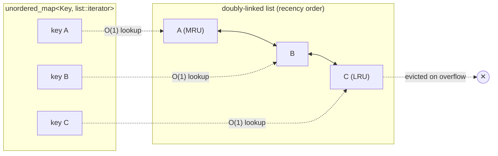

A small, header-only, templated **Least-Recently-Used (LRU) cache** for modern
C++17. Drop a single header into your project, pick your key and value types,
and get a fixed-capacity cache with **O(1)** insert, lookup, and eviction.

## Features

- **Header-only** — just include `lru_cache.hpp`, no build step, no linking.
- **O(1) operations** — `put`, `get`, `contains`, and `erase` are all amortized
  constant time.
- **Templated** — works with any hashable key type and any value type.
- **Recency-aware** — `get` refreshes an entry so frequently used keys survive
  eviction.
- **Non-mutating `peek`** — inspect a value without touching recency order or
  statistics.
- **Hit/miss statistics** — `stats()` reports cumulative `get` hits and misses,
  and `reset_stats()` clears them.
- **`std::optional` lookups** — a miss returns `std::nullopt`, no exceptions on
  the hot path.
- **Modern C++17**, no third-party dependencies.

## Complexity

| Operation        | Time   |
| ---------------- | ------ |
| `put`            | O(1)   |
| `get`            | O(1)   |
| `peek`           | O(1)   |
| `contains`       | O(1)   |
| `erase`          | O(1)   |
| eviction (LRU)   | O(1)   |
| `stats`/`reset_stats` | O(1) |
| `size`/`capacity`| O(1)   |

## API

| Method                       | Description                                                              |
| ---------------------------- | ------------------------------------------------------------------------ |
| `put(key, value)`            | Insert or update an entry and mark it most-recently-used.                |
| `get(key) -> optional<V>`    | Look up a key, refresh its recency, and record a hit/miss in the stats.  |
| `peek(key) -> optional<V>`   | Look up a key **without** changing recency order or statistics.          |
| `contains(key) -> bool`      | Test for presence without affecting recency.                             |
| `erase(key) -> bool`         | Remove an entry; returns whether one was removed.                        |
| `clear()`                    | Remove all entries (statistics are unaffected).                          |
| `stats() -> Stats`           | Cumulative `{ hits, misses }` accumulated by `get`.                      |
| `reset_stats()`              | Reset the hit/miss counters to zero.                                     |
| `size()` / `capacity()`      | Current entry count / maximum capacity.                                  |
| `empty() -> bool`            | Whether the cache holds no entries.                                      |

## How it works

The cache keeps a doubly linked list ordered from most- to least-recently-used,
plus a hash map from each key to its node in that list. Lookups go through the
map in O(1); on a hit or insert, the node is spliced to the front. When the
cache is full, the entry at the tail (least recently used) is evicted.



## Usage

```cpp
#include "lru_cache.hpp"
#include <iostream>

int main() {
    lru::LRUCache<int, std::string> cache(2);  // capacity = 2

    cache.put(1, "one");
    cache.put(2, "two");

    std::cout << *cache.get(1) << "\n";  // one   (key 1 is now most-recently-used)

    cache.put(3, "three");               // capacity exceeded -> evicts key 2 (LRU)

    std::cout << cache.contains(2) << "\n";  // 0  (key 2 was evicted)
    std::cout << cache.contains(1) << "\n";  // 1
    std::cout << cache.contains(3) << "\n";  // 1

    auto miss = cache.get(2);
    std::cout << miss.has_value() << "\n";   // 0  (std::nullopt on a miss)

    // peek inspects a value without promoting it or counting in the stats.
    std::cout << *cache.peek(1) << "\n";     // one  (recency unchanged)

    // stats() reports cumulative get() hits and misses (peek is not counted).
    auto s = cache.stats();
    std::cout << s.hits << " " << s.misses << "\n";  // 1 1
    cache.reset_stats();
}
```

Expected output:

```
one
0
1
1
0
one
1 1
```

## Building and testing

This project uses CMake. To build and run the test suite:

```sh
cmake -S . -B build
cmake --build build
ctest --test-dir build --output-on-failure
```

On Windows with MinGW-w64, select the matching generator:

```sh
cmake -S . -B build -G "MinGW Makefiles"
cmake --build build
ctest --test-dir build --output-on-failure
```

### Running tests

```sh
ctest --test-dir build --output-on-failure
```

The tests cover put/get basics, LRU eviction on overflow, recency refresh on
`get`, updating an existing key without growing, `erase`/`clear`, the capacity
boundary, `std::nullopt` on a miss, non-mutating `peek` (no recency change, no
stats change), and hit/miss statistics with `reset_stats`.

## Consuming the header

Because the library is header-only, you can simply copy `include/lru_cache.hpp`
into your project, or add the include directory to your build.

With CMake, you can pull in the provided INTERFACE target:

```cmake
add_subdirectory(lru-cache-cpp)
target_link_libraries(your_target PRIVATE lru_cache::lru_cache)
```

Then include it:

```cpp
#include "lru_cache.hpp"
```

## License

Released under the [MIT License](LICENSE). Copyright (c) 2026 Geovana Grigorio.
