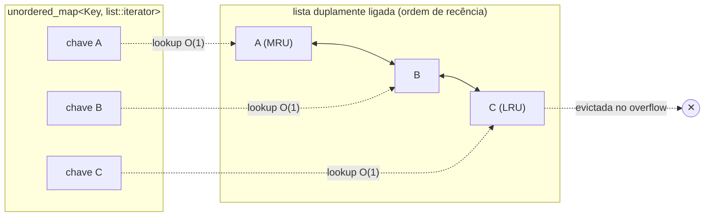

<!-- ══════════════════════════ TÍTULO ══════════════════════════ -->
<div align="center">
  
</div>

<br/>

<!-- ══════════════════════ IDIOMAS / LANGUAGES ══════════════════════ -->
<div align="center">
<a href="README.md"></a>
<a href="README.en.md"></a>
<a href="README.es.md"></a>
</div>

<br/>

<div align="center">


</div>

<div align="center">
<a href="#sobre"></a>
<a href="#como-funciona"></a>
<a href="#api"></a>
<a href="#uso"></a>
</div>

<br/>

> 📦 **Header-only.** Só inclua `lru_cache.hpp` — sem build step, sem linkagem.

## Sobre

Um cache **LRU (Least-Recently-Used)** pequeno, header-only e templated pra C++17 moderno. Escolha o tipo de chave e valor, e tenha um cache de capacidade fixa com inserção, busca e evicção em **O(1)**.

**Destaques:**
- **Header-only** — sem build step, sem linkagem.
- **Operações O(1)** — `put`, `get`, `contains` e `erase` são todas amortizadas em tempo constante.
- **Templated** — funciona com qualquer tipo de chave hasheável e qualquer tipo de valor.
- **Recency-aware** — `get` atualiza a entrada pra que chaves usadas com frequência sobrevivam à evicção.
- **`peek` não-mutante** — inspeciona um valor sem alterar a ordem de recência ou as estatísticas.
- **Estatísticas de hit/miss** — `stats()` reporta hits/misses cumulativos de `get`.
- **Buscas com `std::optional`** — um miss retorna `std::nullopt`, sem exceções no caminho quente.

## Como Funciona

O cache mantém uma lista duplamente ligada ordenada do mais- ao menos-recentemente-usado, mais um hash map de cada chave pro seu nó nessa lista. Buscas passam pelo map em O(1); em um hit ou insert, o nó é movido pra frente. Quando o cache está cheio, a entrada na cauda (menos recentemente usada) é evictada.


```mermaid
flowchart LR
    subgraph MAP["unordered_map&lt;Key, list::iterator&gt;"]
        K1["chave A"]
        K2["chave B"]
        K3["chave C"]
    end

    subgraph LIST["lista duplamente ligada (ordem de recência)"]
        direction LR
        N1["A (MRU)"] <--> N2["B"] <--> N3["C (LRU)"]
    end

    K1 -. lookup O(1) .-> N1
    K2 -. lookup O(1) .-> N2
    K3 -. lookup O(1) .-> N3

    N3 -. evictada no overflow .-> X(("✕"))
```

## API

| Método | Descrição |
|---|---|
| `put(key, value)` | Insere ou atualiza uma entrada e marca como mais-recentemente-usada |
| `get(key) -> optional<V>` | Busca uma chave, atualiza sua recência, registra hit/miss |
| `peek(key) -> optional<V>` | Busca **sem** mudar a ordem de recência ou estatísticas |
| `contains(key) -> bool` | Testa presença sem afetar recência |
| `erase(key) -> bool` | Remove uma entrada |
| `clear()` | Remove todas as entradas |
| `stats() -> Stats` | `{ hits, misses }` cumulativos de `get` |
| `size()` / `capacity()` | Contagem atual / capacidade máxima |

## Uso

```cpp
#include "lru_cache.hpp"

lru::LRUCache<int, std::string> cache(2);  // capacidade = 2
cache.put(1, "one");
cache.put(2, "two");
std::cout << *cache.get(1) << "\n";  // one (agora é a mais recente)
cache.put(3, "three");               // excede a capacidade -> evicta a chave 2
```

**Build & testes:**
```sh
cmake -S . -B build
cmake --build build
ctest --test-dir build --output-on-failure
```

**Consumir o header** — copie `include/lru_cache.hpp` no seu projeto, ou via CMake:
```cmake
add_subdirectory(lru-cache-cpp)
target_link_libraries(your_target PRIVATE lru_cache::lru_cache)
```

## Licença

[MIT](LICENSE).

<div align="center">
  
</div>

<p align="center"><sub>Desenvolvido por <strong><a href="https://github.com/geoggrigori">Grigori</a></strong> · 2026</sub></p>
